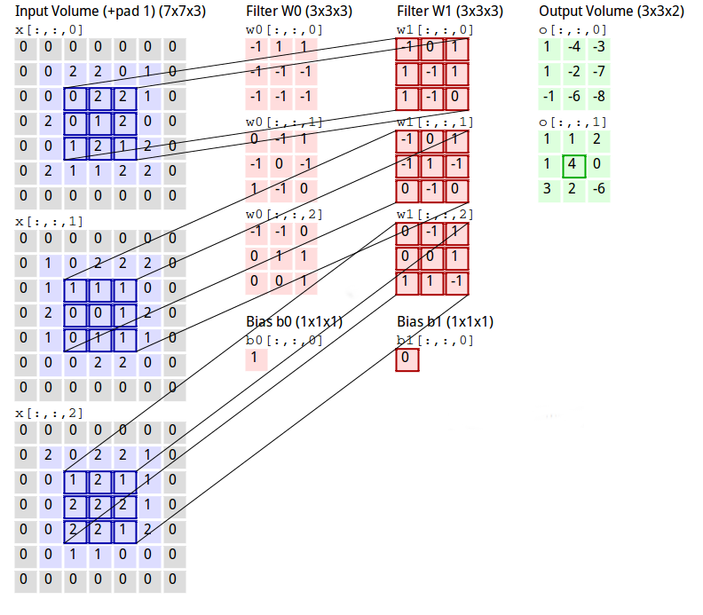
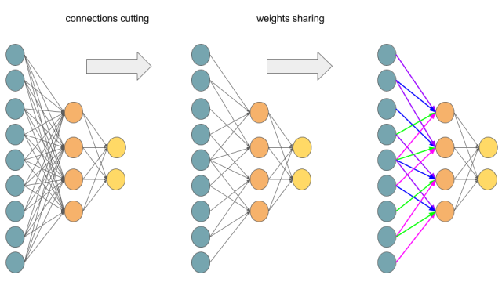
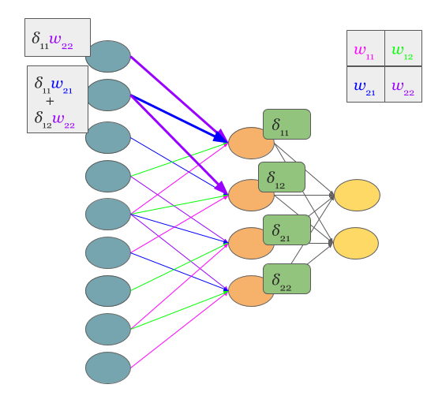
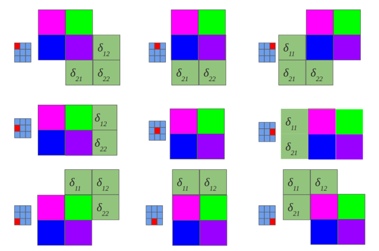

# 卷积神经网络Convolutional Networks

卷积神经网络是一类具有Grid类型拓扑的特殊神经网络[^1]，声音信号可以看做是1维Grid，图像信号可以看做是2维
Grid。比如雷达传感器收到的信号中一般都会包含噪声，我们希望能够找到一种卷积操作来过滤掉这种噪声,
$$\int x(a)w(t-a)da$$那么卷积核$w(a)$应该是多少呢？我们可以通过随机梯度下降法通过模型训练，找出一个
比较合适的卷积核。--这其实就是CNN的工作原理。

离散卷积可以看成矩阵乘法[^2]
$$\left[\begin{matrix}1&2&3&4\\5&6&7&8\\9&10&11&12\end{matrix}\right]*\left[\begin{matrix}1&0\\0&1\end{matrix}\right]$$
这个卷积运算等价于
$$\left[\begin{matrix}1&2&5&6\\2&3&6&7\\3&4&7&8\\5&6&9&10\\6&7&10&11\\7&8&11&12\end{matrix}\right] \times \left[\begin{matrix}1\\0\\0\\1\end{matrix}\right]$$
计算出来的结果，再按照每3个一行进行切割，得到2*3的特征矩阵。所以，实际上卷积神经网络的迭代算法，和全
连接网络的迭代算法，并没有本质的区别。

## 反向传播算法
系统的学习样本为共N组表示为$(X_i,Y_i), \qquad 0 \leqslant i\leqslant N$, 规定L为网络层数，
$0 \leqslant l \leqslant L, W^l$代表$l$层的权重, $b^l$是偏置, $x^l$是第l层的输入。
$$u^l=W^lx^{l-1}+b^l \qquad x^l=f(u^l) \eqno{(1)}$$ 
定义$y$是整个网络的输出 $$y=f(u^{L-1})=f (W^l x^{L-1} + b^l) $$
定义损失函数$$E=\frac{1}{2}(Y-y)^2=\frac{1}{2} \sum_{i=1}^N (Y_i-y_i)^2$$ 
训练时，(X,Y)都是这个方程的已知参数，我们要找一组$W$和$b$，使得$E$最小。

使用随机梯度下降法, $\eta$是学习率，不断迭代，一直到误差率足够小为止。
$$W^l \gets W^l - \eta \frac{\partial E}{\partial W^l}$$ 
$$b^l \gets b^l - \eta \frac{\partial E}{\partial b^l}$$
观察一下(L-1),我们很容易得到系统**敏感度**$\delta=\frac{\partial E}{\partial u}$。我们关心的
$\frac{\partial E}{\partial W^l}$和$\frac{\partial E}{\partial b^l}$都与$\delta^l$的相关，学习误差
在反向传递的时候，实际上被传递的是$\delta$[^3]。
$$\frac{\partial E}{\partial b^l} = \frac{\partial E}{\partial u^l}\frac{\partial u^l}{\partial b^l} 
                                  = \delta^l \frac{\partial u^l}{\partial b^l} = \delta^l$$
$$\frac{\partial E}{\partial W^l} = \frac{\partial E}{\partial u^l} \frac{\partial u^l}{\partial W^l} 
                                  = \delta^l \frac{\partial u^l}{\partial W^l}
                                  = x^{l-1}(\delta^l)^T $$
我们只要知道$\delta^l$问题就可解了。我们来观察一下网络的最后一层,就是$L-1$层，会发现$\delta^{L-1}$很
容易求出来。
$$\delta^{L-1}=\frac{\partial E}{\partial u^{L-1}}
              =\frac{\partial E}{\partial y}\frac{\partial y}{\partial u^{L-1}}
              =(Y-y)\frac{\partial y}{\partial u^{L-1}} 
              =(Y-y) \odot f'(u^{L-1})$$
其中$\odot$表示两个向量逐个元素相乘。 如果不是最后一层怎么解决呢？我们用递归的思路，利用$\delta^{l+1}$
来求解$\delta^l$
$$\delta^{l}=\frac{\partial E}{\partial u^{l}}
            =\frac{\partial E}{\partial u^{l+1}}\frac{\partial u^{l+1}}{\partial u^l}
            =\delta^{l+1}\frac{\partial u^{l+1}}{\partial u^l}
            =(W^{l+1})^T\delta^{l+1} \odot f'(u^l)$$
这样学习误差就随着$\delta$在整个网络中的反向传递而逐渐减小。在实际的工程实现中，我们可以在每层Cache
$u^l$的值，这样不论是前向传播还是后向传播时，这个值都可以使用。

## 卷积层及其梯度计算方法
卷积层同样包含$W^l$和$b^l$,$W^l$表示卷积核，$b^l$代表偏置。卷积层的输出是
$$x^l=f(\sum_i^{K_d} W_i^l*x^{l-1}+b_i^{l})$$ 其中$K_d$表示卷积核的深度(Channel), $*$表示卷积运算, 
$f$是卷积层中使用的非线性函数。 $W^l$的大小设为$K_h \times K_w \times K_d$，一般$K_h$都$K_w$明显小
于输入数据的高$H$和宽$W$。此外，我们还可以同时计算多个卷积核M,每个卷积核可以看成一种特
征，我们可以同时提取出多种特征。另外一般还有两个参数Padding($P$)和Stride($S$),表示两侧缘填充值和卷
积核的滑动步数。那么单个卷积核对应的前向输出大小为$((H+2P-K_h)/S+1) \times ((W+2P-K_w)/S+1) \times K_d$,
如果有多个卷积核，那么还要再乘上$M$。[^4]   
另外，关于卷积的计算有一种高效的1X1计算方法, 在Caffe中也有使用。原始的论文可以参见[^5]

卷积层误差反向传播[^6]的关键仍然是$\delta^l$。在全连接网络中，每一层的反向误差都是通过$W$放大到上一
层的每个节点。但是在卷积网络中，每个卷积层的输出，只会对应输入层的固定部分。这样卷积层的误差也只会
通过这些有限的连接影响前一层的固定节点, 比如Figure-3。可以看出，卷积层的反向传播也是在进行卷积运算,
只不过把卷积核按照空间维度进行了翻转。

具体的计算的卷积过程，可以参见Figure-4。这是一种full卷积方式，卷积核在图片外的部分，也会算在卷
积的结果中。可以看出，经过这种卷积过程之后，结果会变大。这和前向传播时的计算方式不同，前向传播时，
采用了valid卷积方式，卷积核不会超过图像区域的范围，卷积出来的内容只会变小。关于卷积，实际上还有一
种same卷积[^7]

通过整个图上的过程可以看出，卷积神经网络中，不论是前向还是后向传播，卷积操作都替代了之前的乘法操作。
所以，在卷积层中，一个卷积核对应了全连接网络中的一个输出输出节点，尽管这个节点可能是$I\times J$维。
这样, 我们把每一层的输出$x^l$替换成$x_{i,j}^l$ 
$$u_{i,j}^{l+1} = W_{i,j}^{l+1}*f(u_{i,j}^l)+b_{i,j}^{l+1} \eqno{(2)} $$
对一个卷积核来说
$$\begin{aligned} 
  \delta^l_{i,j} & = \frac{\partial E}{\partial u_{i,j}^l} 
                 = \sum_{i'} \sum_{j'} \frac{\partial E}{\partial u_{i',j'}^{l+1}} \frac{\partial u_{i',j'}^{l+1}}{\partial u_{i,j}^l} 
                 = \sum_{i'} \sum_{j'} \delta_{i',j'}^{l+1} \frac{\partial u_{i',j'}^{l+1}}{\partial u_{i,j}^l}  \\
                 & = \sum_{i'} \sum_{j'} \delta_{i',j'}^{l+1} \frac{\partial (\sum_a \sum_b W_{a,b}^{l+1} f(u_{i'-a,j'-b}^l) + b_{i',j'}^{l+1})}{\partial u_{i,j}^l} 
  \end{aligned} \eqno{(3)} $$ 
上式右侧的对两个和式的求导特别复杂，但是结果特别简单。除了$i=i'-a$并且$j=j'-b$的情形外，其余所有结果
都是0。
$$
\sum_{i'} \sum_{j'} \delta_{i',j'}^{l+1} \frac{\partial (\sum_a \sum_b W_{a,b}^{l+1} f(u_{i'-a,j'-b}^l) + b_{i',j'}^{l+1})}{\partial u_{i,j}^l} 
= \sum_{i'} \sum_{j'} \delta_{i',j'}^{l+1} W_{a,b}^{l+1}f'(u_{i,j}^l)
\eqno{(4)} $$ 
再把$a=i'-i$,$b=j'-j$代入(4) 
$$\begin{aligned}
  \delta^l_{i,j} & =  \sum_{i'} \sum_{j'} \delta_{i',j'}^{l+1} W_{i'-i,j'-j}^{l+1}f'(u_{i,j}^l) \\
  \delta^l_{i,j} & = \delta^{l+1}_{i,j} * W^{l+1}_{-i, -j}f'(u_{i,j}^l) 
   \end{aligned} \eqno{(5)} $$
这样，每一层的误差都是同旋转180度之后的权重进行卷积，并且向后传播的。定义$ROT180(w_{i,j}^l)=w_{-i,-j}^l$, 
$$\frac{\partial E}{\partial b_{i,j}^l} = \delta^l_{i,j}=\delta^{l+1}*ROT180(W_{i,j}^{l+1})f'(u_l)  \eqno{(6)} $$
使用类似的思路，我们可以计算出
$$\begin{aligned}
\frac{\partial E}{\partial W_{i,j}^l} & = \sum_{i'} \sum_{j'} \frac{\partial E}{\partial u_{i',j'}^l} \frac{\partial u_{i',j'}^l}{\partial W_{i,j}^l}  \\
                                      & = \delta^l_{i,j} * f(ROT180(u_{i,j}^{l-1})) 
\end{aligned} \eqno{(7)} $$

##卷积神经网络的基本运算
###Relu
   Relu(Rectified Linear Units)激活函数是一种非线性函数运算$f(x)=max (x, 0)$,这种运算在卷积神经网络
   中基本替代了之前的Sigmoid函数。解决了_梯度消失和梯度爆炸问题_,在caffe中，它允许用户使用它的leaky
   变形，$$f(x)=\begin{cases}x, x>0 \\ \alpha x, otherwise \end{cases}$$ 

   Caffe中反向传递时，Relu也很简单，只是向后传递了那些前向传输时，输入层数据大于0单元的梯度；小于0的
   单元梯度都是0。

### Pooling
   Pooling运算是一种Sup-Sampling。简单的说，就是把$M \times N$的图像区域按照$K \times K$的大小进行
   划分，然后每个区域进行AVE或者MAX运算，得到$M/K \times N/K$大小的特征图像。比如原图像大小为
   $16 \times 16$, 我们希望进行2:1的采样，那么采用2*2的Pooling-Region大小，会得到$8 \times 8$的结果
   图像。Pooling操作一般紧跟卷积层之后，它带来了某种"不变性"，就是图像中只要在某片区域中出现了某个
   信息就判定结果为真，而不要求图像每个像素点都同预期完全一致，现在主要使用的Pooling类型为Max-Pooling。
    
   问题是在反向传播的时候，Pooling的行为是怎么样的?[^3]在Caffe中，我们很容易看到Max-Pooling层向前传
   递结果时，会把产生的最大值坐标记录到mask中；在反向传递误差的时候，根据这个mask值去将之前传递的最
   大值的误差向后传递。如果是AVE-Pooling，误差实际上是top层区域内误差的平均值。

### Normalization
   在Caffe中，归一化的操作是由LRN层(Local Response Normalization)局部响应归一化层来实现的。
   $$b^i_{x,y} = a^i_{x,y}/(k+\alpha \sum_{j=max(0, i-n/2)}^{min(i+n/2,N-1)}(a^i_{x,y})^2)^{\beta}$$
   $a^i_{x,y}$代表了卷积核i在(x,y)位置处进行运算，然后使用Relu之后的输出。$b^i_{x,y}$是归一化之后的响
   应，归一化区域的大小$n$同卷积核的大小一致, N是这一层总的卷积核数。这种机制是受到生物体神经元的启发，
   对局部神经元的活动创建竞争机制[^8]， 一般$k = 2$, $\alpha= 10^{-4}$, $\beta = 0.75$,在Caffe
   中采用了$\alpha /n$来代替$\alpha$。

### Dropout
   Dropout是一种计算很简单的防止模型过拟合的方式[^9]。关键思路就是在训练时，随机丢弃掉一些单元的输出
   (和包括它们的连接)，但是在测试时，这些单元和连接则会一直存在。最简单的情况下，在训练时，每个单元
   都会以比如0.5的概率不会输出，每轮的训练都会记录下来这些失效单元的位置。在反向传递误差的时候，只有
   有效的单元数据才会被输出。

[^1]: https://www.deeplearningbook.org/contents/convnets.html
[^2]: https://erlangz.wordpress.com/Convolution.html
[^3]: http://neuralnetworksanddeeplearning.com/index.html
[^4]: http://cs231n.github.io/convolutional-networks/#conv
[^5]: `Network_In_Network`-from:Min_Lin
[^6]: https://grzegorzgwardys.wordpress.com/2016/04/22/8/
[^7]: https://cn.mathworks.com/help/matlab/ref/conv2.html
[^8]: http://papers.nips.cc/paper/4824-imagenet-classification-with-deep-convolutional-neural-networks.pdf
[^9]: [Dropout:_A_Simple_Way_to_Prevent_Neural_Networks_from_Overfitting](https://www.cs.toronto.edu/~hinton/absps/JMLRdropout.pdf)

