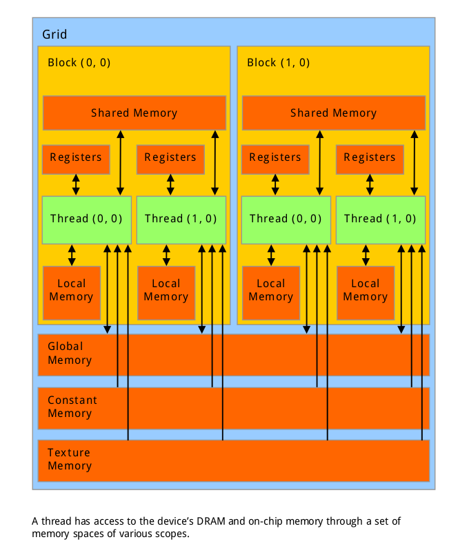

#Cuda - Compute Unified Device Architecture[^1]
随着技术的发展，主流的CPU和GPU现在都已经是并行系统。Cuda被设计出来解决这个问题，在GPU上开发出可以透
明扩展到多核的软件，之前只有3D图像程序可以透明扩展到多核。Cuda有三种比较关键的抽象*层次化的线程组*,
*共享内存*,*barrier同步机制*，关键是它提供了类似C语音的接口。

##Cuda编程模型
1. Kernels

Kernels是独立运行的类C语音函数，它会再Cuda的各个核中不断的被重复调用。下边是一个完成两向量相加运算
的Kernels。
```
// Kernel definition
__global__ void VecAdd(float* A, float* B, float* C) {
    int i = threadIdx.x;
    C[i] = A[i] + B[i];
}

int main() {
    ...
    // Kernel invocation with N threads
    VecAdd<<<1, N>>>(A, B, C);
    ...
}

```
2. 层次化线程及数据同步

在Cuda中，一个Thread运行一个Kernels。一系列Thread聚合成Thread-Block，很多Thread-Block在一个Grid中执行。
在比较旧的GPU中，整个设备只有一个Grid，新的显卡中，可能存在多个Grid。在GPU硬件中，SP(Streaming Prossessor)
是最终执行指令的地方，也被称为Cuda的Core。[^2]   
Cuda采用了SIMD(Single Instruction, Multiple Data Arch)
指令集，一个单条指令发出后，每个SP都会同时执行相同的指令。SM(Stream Multi-Processor)是由多个SP加上其
他资源，比如warp调度器，寄存器，共享内存等等组成。从软件上看，SM更像一个CPU的内核，GPU的并行度就是由
SM决定的，每个SM都可以支持数百线程同时执行。当一个Kernels启动的时候，会被分配到这些SM中，大量的线程
可能会被分配到不同的SM， *同一个block中的Kernels必然会在同一个SM中*，每个线程都拥有自己的程序计数器
和状态寄存器，并且使用该线程自己的数据进行执行，这就是所谓的SIMD。  
```
Detected 1 CUDA Capable device(s)

Device 0: "GeForce GT 705"
CUDA Driver Version / Runtime Version          8.0 / 7.5
CUDA Capability Major/Minor version number:    2.1
Total amount of global memory:                 1982 MBytes (2078277632 bytes)
( 1) Multiprocessors, ( 48) CUDA Cores/MP:     48 CUDA Cores
GPU Max Clock rate:                            1747 MHz (1.75 GHz)
Memory Clock rate:                             825 Mhz
Memory Bus Width:                              64-bit
L2 Cache Size:                                 65536 bytes
Maximum Texture Dimension Size (x,y,z)         1D=(65536), 2D=(65536, 65535), 3D=(2048, 2048, 2048)
Maximum Layered 1D Texture Size, (num) layers  1D=(16384), 2048 layers
Maximum Layered 2D Texture Size, (num) layers  2D=(16384, 16384), 2048 layers
Total amount of constant memory:               65536 bytes
Total amount of shared memory per block:       49152 bytes
Total number of registers available per block: 32768
Warp size:                                     32
Maximum number of threads per multiprocessor:  1536
Maximum number of threads per block:           1024
Max dimension size of a thread block (x,y,z): (1024, 1024, 64)
Max dimension size of a grid size    (x,y,z): (65535, 65535, 65535)
Maximum memory pitch:                          2147483647 bytes
Texture alignment:                             512 bytes
Concurrent copy and kernel execution:          Yes with 1 copy engine(s)
Run time limit on kernels:                     Yes
Integrated GPU sharing Host Memory:            No
Support host page-locked memory mapping:       Yes
Alignment requirement for Surfaces:            Yes
Device has ECC support:                        Disabled
Device supports Unified Addressing (UVA):      Yes
Device PCI Domain ID / Bus ID / location ID:   0 / 1 / 0
Compute Mode:
< Default (multiple host threads can use ::cudaSetDevice() with device simultaneously) >

deviceQuery, CUDA Driver = CUDART, CUDA Driver Version = 8.0, 
             CUDA Runtime Version = 7.5, NumDevs = 1, Device0 = GeForce GT 705

```
一个SP可以执行一个线程，但不是所有的线程都在同一时刻执行。NVIDIA把32个线程组成一个Warp，Warp是调度和
执行的基本单元。Warp中所有线程并行，并且指令相同(但是每个Kernels都有自己的分支，实际执行的代码可能
并不完全一样)。一个Warp需要占用一个SM进行执行，多个Warp轮流进行SM，这有SM的Warp调度器负责管理。所以
，一个CPU上的常驻线程数，实际上是SM * Warp-thread(32)个。

如图所示，同一Warp的线程可以任意顺序执行，当一个Warp空闲的时候，SM就可以调度驻留的另一个可用Warp,*在
并非的Warp之间进行切换并不消耗任何资源*，因为硬件资源早就分配给了Thread和Block，这一点同CPU明显不同，
进场间切换并不需要保存现场, 这就是所谓的硬件多线程。  


Cuda的Kernels中，尽量不要有if，while等分支操作，尽量让所有线程的执行路径一致。否则在每个Warp中，只能
先选取一个执行路径，关掉不在这个路径中的线程，继续执行；执行完毕后再回来，执行原来被关掉的线程。实际
上一个Warp一次只能执行一条指令。

每个线程都有自己单独的线程号，为了方便处理，threadIdx是一个三元组(x,y,z)，这样threadIdx就能表示成1维，
2维和3维向量；形成1维，2维和3维的thread-block。这种方式天然的让用户可以进行Vector，Matrix和Volume的
运算, 计算方法自然是$x+Dx*y+Dx*Dy*z$。但是，一个thread-block中能存放的线程数是有上限的，一般是1024。
复杂一点的数据寻址方式如下:
```
// Kernel definition
__global__ void MatAdd(float A[N][N], float B[N][N], float C[N][N]) {
    int i = blockIdx.x * blockDim.x + threadIdx.x;
    int j = blockIdx.y * blockDim.y + threadIdx.y;
    if (i < N && j < N)
    C[i][j] = A[i][j] + B[i][j];
}

int main() {
    ...
    // Kernel invocation
    dim3 threadsPerBlock(16, 16);
    dim3 numBlocks(N / threadsPerBlock.x, N / threadsPerBlock.y);
    MatAdd<<<numBlocks, threadsPerBlock>>>(A, B, C);
    ...
}

```

_每个Grid中的Thread-Block都是独立执行的，但是每个Block内部的线程都可以进行同步和数据共享。_在Kernels
内部调用__syncthreads()函数，可以设置同步点，同步一个线程块内的线程。

3. 内存模型

Cuda的内存模型如下  

- 每个线程都有自己独立的可读写寄存器和local-memory
- 每个Block中的线程共享一块shared-memory
- 每个Grid都有自己的可读写global-memory，还有只读的constant-memory和text-memory。
  

## 最佳编程实践
- serial workloads to the host; parallel workloads to the devices
- 尽量多使用block内部共享，少使用global内存共享数据。前者只需要设置同步点，然后直接读取；后者需要两
  通信的Kernel使用两个不同的接口，分别进行读写。

[^1]:http://docs.nvidia.com/cuda/cuda-c-programming-guide/index.html#axzz4WAfFSKwp
[^2]:http://blog.csdn.net/junparadox/article/details/50540602


