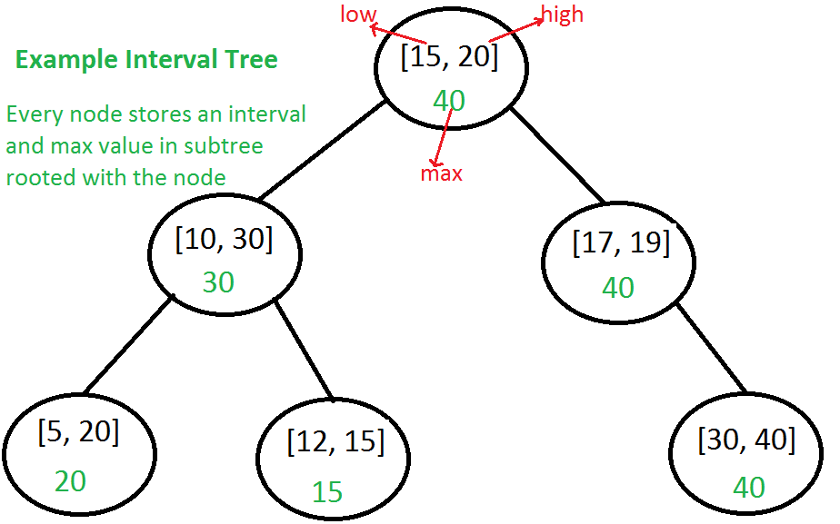
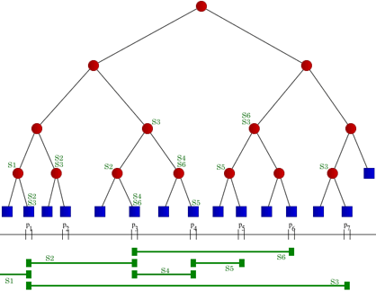

# Tree Data Structure
## Interval Tree
  在图论中，Interval tree[^1]用来存储区间。它可以高效的检索到同某个点有交点的所有区间。一般经常用在
  区间查询的场景中。比如，在一份电子地图的矩形视图中找到所有的道路，或者在三维空间中找到所有可见元素。
  要查询同一个点或者一个区间相交的所有区间，一般的解决思路是遍历每个已知的区间，判定这两个区间(点)
  是否相交。显然，这需要O(n)的时间，而且一次查询可能返回所有的区间，这是一种“渐进最优”(Asymptotically
  optimal Algorithm)。我们可以设法将算法改成“输出敏感”的(Output Sensitive)。

  Interval Tree的每个节点都存储了一个区间\[lower, upper), value区间存储了这个区间内要查询的结果[^2]。
  

## Segment Tree
  线段树也是一种用来存储区间的数据结构, 它可以用来查询某些给定的线段(因为线段会被标记为In/Out状态)
  是否包含某个点.
  给定一个区间集合I={Intervals}, 线段树T是一个二叉树,

  

[^1]: https://en.wikipedia.org/wiki/Interval_tree
[^2]: http://www.geeksforgeeks.org/interval-tree/
